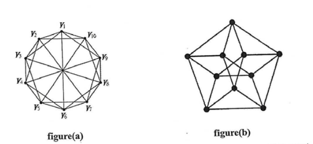
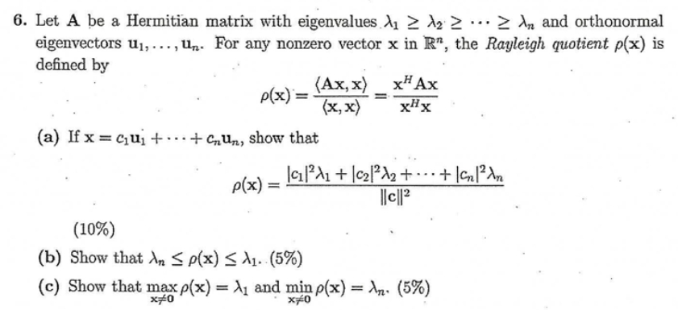
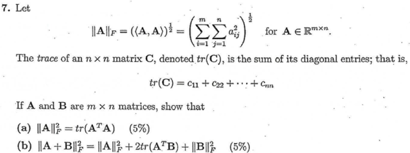

# 111 成大

1. How many bit string of length 20 contain at most Nineteen 1s? Please expressed as $A^B + C$
    - (a) A = 2
    - (b) B = 20
    - (c) C = -1

    ANS: 全部減掉 有20個1的 => $2^{20}-1$
2. Let (u,v) be a minimum-weight edge in a connected graph G. Show
that (u,v) belongs to some minimum spanning tree of G

    Step 1: 反證法

        if (u,v) not belong to any MST T。Means that at least one path P from u to v, and all edge not belongs to T.So there's at least one edge from P not in T.

    Step 2:

        so if the edge is (x,y). Then if we delete (x,y) from T, and substitude with (u,v), then it will be a new generation tree T'。 Because (u,v)'s weight is smaller then (x,y), thus T's weight is samller then T。 so it is a Contradiction。

    Step 3:

        so if we pretend we delete (x,y), T' is nolonger a generation tree。Which means that P is at least one edge not in T。 we can reproduce this way until we found one edge not in T, (and when it added into T, it will be a new generation tree)。 this edge (u,v) must belong to some MST
        then we proved this.
3. A={5,6,7,8},B={u,v},C={}
    consider a = |Power Set(A)|
    b=|A \times B|
    c=|Power Set(C)|
    Please calculate $2^c + b + a$.

    a = |P(A)| = 16

    b = |A x B| = 8

    c = |P(C)| = 1

    $2^c + b + a = 24$

4. x
    - (a) How many quadrilateral(四邊形) are determined by the vertices of a regular polygon of n sides? (n > = 4)

        $n * (n - 1) * (n - 2) * (n - 3) / 24$

    - (b) How many if no side of the polygon is to be a side of any quadrilateral? (n > = 8)

        $n * (n - 1) * (n - 2) * (n - 3) * (n - 4) * (n - 5) / 120$

5. Calculate the chromatic number of figure(a) and figure(b)
. (not need to explain)

    

    - (a) 10

    - (b) 5

6. 第六題
    

    - (a)
        由於 A 是 Hermitian 矩陣，因此我們可以將內積展開為：

        $ρ(x) = \frac{\langle x, Ax \rangle}{\langle x, x \rangle} = \frac{\langle x, u_1 \rangle \lambda_1 u_1 + \langle x, u_2 \rangle \lambda_2 u_2 + ... + \langle x, u_n \rangle \lambda_n u_n}{\langle x, x \rangle}$

        由於 $u_1, u_2, ..., u_n$ 是 orthonormal 特徵向量，因此我們可以得到：

        $ρ(x) = \frac{|c_1|^2 \lambda_1 + |c_2|^2 \lambda_2 + ... + |c_n|^2 \lambda_n}{||x||^2}$

        其中，$c_1, c_2, ..., c_n$ 是 $x$ 在 $u_1, u_2, ..., u_n$ 上的投影係數。

        所以: $ρ(x) = \frac{|c_1|^2 \lambda_1 + |c_2|^2 \lambda_2 + ... + |c_n|^2 \lambda_n}{||x||^2}$
    - (b) 使用 Cauchy-Schwarz 不等式
        $(c_1^2 + c_2^2 + ... + c_n^2)(λ_1 c_1^2 + λ_2 c_2^2 + ... + λ_n c_n^2) ≥ (c_1^2 \lambda_1 + c_2^2 \lambda_2 + ... + c_n^2 \lambda_n)^2$

        化簡可得 $λ_n ≤ ρ(x) ≤ λ_1$
    - (c) 由上可證

7. 第七題:
    

8. Let A be a symmetric n x n matrix. Show that $e^A$ is symmetric and positive definite.

    Symmetry:
        $(e^A)^T = e^{A^T}$

    Positive Definiteness:
        $(e^A)^T = e^{A^T}$

    Let $x = (x_1, x_2, ..., x_n)^T$

    $x^T e^A x = (x_1, x_2, ..., x_n)^T e^A (x_1, x_2, ..., x_n)$

    $x^T e^A x = e^A x_1 x_1^T + e^A x_2 x_2^T + ... + e^A x_n x_n^T

    $x^T e^A x = x_1^T e^A x_1 + x_2^T e^A x_2 + ... + x_n^T e^A x_n$

    $A = S^{-1} D S$

    $e^A = S^{-1} e^D S$

    $e^A = S^{-1} diag(e^d_1, e^d_2, ..., e^d_n) S$

    $x^T e^A x = x^T S^{-1} diag(e^d_1, e^d_2, ..., e^d_n) S x$

    $x^T e^A x = x^T diag(e^d_1, e^d_2, ..., e^d_n) x$

    $x^T e^A x = x_1^2 e^d_1 + x_2^2 e^d_2 + ... + x_n^2 e^d_n > 0$

9. Let A be a singular n x n matrix.  Show that $A^TA$ is positive semideinite, but not
positive defnite.

    半正定性：

    對於任何非零向量 x，我們有：

    $x^T (A^TA) x = (x^T A)^T A x = x^T A^T A x$

    由於 A 是奇異的，因此存在一個非零向量 y，使得 Ay = 0。將 y 代入上式，我們有：

    $0 = y^T A^T A y = y^T (A^TA) y$

    這意味著 $A^TA$ 的所有特徵值都非負。因此，$A^TA$ 是半正定矩陣。

    非正定性：

    如果 $A^TA$ 是正定矩陣，則對於任何非零向量 x，我們有：

    $x^T (A^TA) x > 0$

    但如果 A 是奇異的，則存在一個非零向量 y，使得 Ay = 0。將 y 代入上式，我們有：

    $0 = y^T (A^TA) y = 0$

    這與 $A^TA$ 是正定矩陣的假設相矛盾。因此，$A^TA$ 不是正定矩陣。

    ex:

    $A = \begin{pmatrix}
    0 & 1 \\
    0 & 0
    \end{pmatrix}$

    $A^TA = \begin{pmatrix}
    0 & 0 \\
    0 & 0
    \end{pmatrix}$

    ** $A^TA$ 的所有特徵值都為 0，因此 $A^TA$ 是半正定矩陣。但 $A^TA$ 的所有特徵值都為 0，因此 $A^TA$ 不是正定矩陣。
