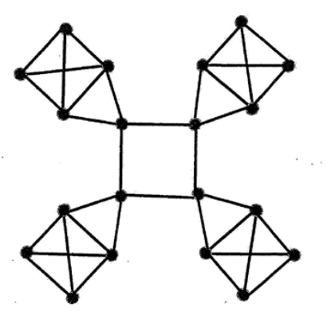

# 110 成大數學

1. 
    - (a) Assume that each vertex has a unique id, how many different spanning trees in
the following figure?
    - (b) We can show that the set {(x,y) | x,y are positive integers} is countable by finding a 1-1 mapping from (x,y) to an integer. Given (1,1)->1, (1,2)->2,(1,3)->4,(1,4)->7,(2,1)->3, (2,2)->5, (2,3)->8, (3,1)->6, (3,2)->9, (4,1)->10, please find which (x,y) maps to 465?
2. 第二題
    - (a) Please prove that x5-2x*+x3-2x3-7x-1=0 has a solution x which is an integer.
    - (b) Given a 4x82 grid, each vertex is colored in one of three different colors, please show that we can always find a rectangle with four vertices in the same color.

3. 第三題
    - (a) Assume N is a positive integer, please show that the statement "if 2N -1 is prime,then N is prime" is true using proof by contrapositive.
    - (b) 5*n+7*m=N, where n,m,N are integers and nz0, m20, Nz24. Please show that we can always find n, m to satisfy the equality. For example, (n,m)=(2,2) corresponds to 5*2+7*2=24 and (n,m)=(5,0) corresponds to 5*5+7*0=25.
    - (c) Assume a set G whose elements are real numbers and the size of G is equal to 2K, where k is a positive integer. We just want to find the maximum value and the minimum value in this set G and develop an algorithm in the following.

            FindMaxMin(G)
            If G contains only two numbers, then compare these two numbers,
            set M to be the larger one, and set m to be the smaller one,
            Else
            Divide G into two subsets with equal size G1 and G2
            Apply FindMaxMin(G1) to get M1 and m1
            Apply FindMaxMin(G2) to get M2 and m2
            M=max(M1,M2),m=min(m1,m2)
            Return M,m

        We use T(N) to represent the number of comparisons when the set size is equal to N. N=2K.
        Please find T(N) in terms of N.

4. Find the curve y = C(-2)* + D(-1)ttl, which gives the least squares fit to points (x, y) = (0,0),(1,4),(2,6).
5. 第五題
    - (a) Given A = $\begin{bmatrix}1&1&1\\1&1&0\\-1&0&1\\0&0&1\end{bmatrix}$ Find the Gram-Schmidt QR decomposition of A, then use that decomposition to solve the least squares problem.$Ax = \begin{bmatrix}1\\2\\3\\4\end{bmatrix}$
    - (b) Given $A = \begin{bmatrix}10&5\\-11&2\\-2&14\end{bmatrix}$.Find the pseudoinverse of A.

6. Two eigenvectors of this circulant matrix C are $(1,i,i^2,i^3)^T$ and $(1,i^2,i^4,i^6)^T$. What are the eigenvalues $\lambda_0$ and $\lambda_1$?

    $\begin{bmatrix}c_0&c_1&c_2&c_3\\c_3&c_0&c_1&c_2\\c_2&c_3&c_0&c_1\\c_1&c_2&c_3&c_0\end{bmatrix}\begin{bmatrix}1\\i\\i^2\\i^3\end{bmatrix}=\lambda_0\begin{bmatrix}1\\i\\i^2\\i^3\end{bmatrix}$
    and
    $\begin{bmatrix}c_0&c_1&c_2&c_3\\c_3&c_0&c_1&c_2\\c_2&c_3&c_0&c_1\\c_1&c_2&c_3&c_0\end{bmatrix}\begin{bmatrix}1\\i^2\\i^4\\i^6\end{bmatrix}=\lambda_0\begin{bmatrix}1\\i^2\\i^4\\i^6\end{bmatrix}$
