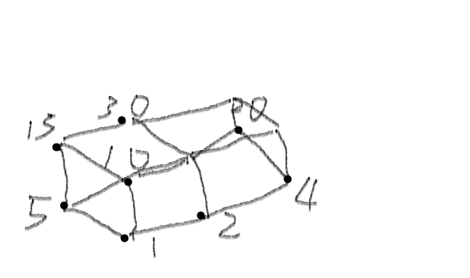

# 105 中興數學

1. Answer the following questions. (4 % each)
    - (i) What is the general solution for the linear congruence $4x \equiv 5 mod 7$?

        $? \equiv 5 mod 7$

        $? = 12,19,26,33,40,47,54,61,68$

        $12 = 4 *3,40 = 4 * 10, 68 = 4 * 17$

        $x = 3 + 7t$
    - (ii) How many solutions are there to the equality $y_1 + y_2+ y_3=13$, where $y_1, y_2, y_3$ are positive integers?

        $C^12_2 = 66$
    - (iii) What are the minimal number of colors needed for a coloring of the graphs: $C_4$ and $W_4$, which represent cycle and wheel respectively?

        $C_4 = 2$

        $W_4 = 3$
    - (iv)How many edges does a full binary tree with 99 internal vertices have?

        198
    - (v) How many bit strings of length 8 either start with a O-bit or end with 01?

        $2^7+2^6-2^5$
    - (vi) The following arithmetic expression is written in prefix notation. Please re-write it using infix notation. $*/9 3+*2 4-7 6$

        $inorder =(9/3)*((2*4)+(7-6))$

2. True or false (2 % for each correct answer and -1 % for each wrong answer)
    - F (a) Assume that a and p are positive integer greater than 1. If p is a prime, then $a^{p-1} \equiv 1 mod p$.
    - F (b) There exists an Euler path in the hypercube $Q_3$.
    - T (c) The number of rationals in (0,1) is in infinite but is countable.
    - T (d) $ 5^{222} = 3 (mod 11)$.
    - T (e) "$\neg (\exists x f(x))" = "\forall x \neg f(x)"$, where $\neg$ stands for "not', $\equiv$ for logical equivalence.
    - F (f)Let P(x) and Q(x) be propositional functions. $\exists x (P(x)\bigwedge Q(x)) \equiv (\forall x P(x) \bigwedge \forall x Q(x))$.
    - F (g) The minimal number of colors needed for a coloring of plannar graphs is no more than 3.
    - F (h) The relation R is not antisymmetric on S, where R={(2,1), (3,1), (3,2), (4,1), (4,2), (4,3)} and S={1,2,3,4}.

3. Pleae draw the Hasse Diagram of the poset ({1,2,4,5,10,15,20,30},\\ ). (8%)
Determine and explain whether this diagram is a lattice or not. (4%)

    

         a lattice is a partially ordered set in which every two elements have a unique supremum (also called a least upper bound or join) and a unique infimum (also called a greatest lower bound or meet)

    no
