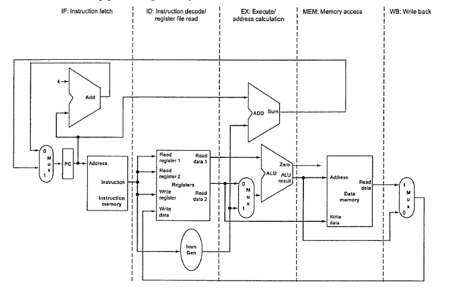

# 112 成大 計組

1. Please select a correct answer for each of the following questions.
    - (1) [2%] Which onc of the following is correct?
        - (a). Android cannot provide the same level of protection as UNIX, because it is not able to separate users.
        - (b), root user can modify mandatory access control (MAC).
        - (c). Role-based access control (RBAC) increases the security risk associated with superusers.
        - (d). Apple's systems employ capability-based protection in the form of entitlements.
    - (2) [2%] Which one of the following is false?
        - (a). A disk drive may have many partitions each of which contains a different file system.
        - (b). An NFS (Network File System) is building on a RPC (Remote Procedure Call) system.
        - (c). In file systems consistent with Session Semantics, the changes in a file are made visible to new sessions only, but are not seen by current sessions.
        - (d). You can access a file in an unmounted file system.
    - (3) [2%] Which one of the following is correct?
        - (a). The file allocation table (FAT) has one entry for each block and is indexed by block number.
        - (b). The consistency check is always able to recover the structures, e.g., resulting in loss of files and cntire directorics.
        - (c). Storage devices that do not allow overwrite (such as NVM devices) need only the free list for managing frce
        - (d). The addresses of a given number of free blocks can be found faster using linked list rather than using grouping.
    - (4) [2%] Unified virtual memory uses to cache both process page and file data
        - (a). disk block caching
        - (b). double caching
        - (c).buffer caching
        - (d).page caching space.
    - (5) [2%] IBM's indexed sequcntial access method (ISAM)
        - (a). uses an index file for sequential access
        - (b). uses a small master index (kept in memory) that points to disk blocks of a secondary index, while the secondary index blocks point to the actual file blocks
        - (c). use the pointers (kept in memory) of the actual file blocks
        - (d). uses the pointers (kept in memory) that points to disk blocks of a master index which points to disk blocks of a secondary index, while the secondary index blocks point to the actual file blocks
    - (6) [2%] In polling I/O, the main inefficiency comes from
        - (a). the hardware controller when it notifies the CPU that the device is ready for scrvice.
        - (b). the basic polling operation that may be comprised of several CPU instructions.
        - (c). polling when it is attempted repeatedly yet rarely finds a device ready for service.
        - (d). the slow data transfer rate between a device and the host.
    - (7) [2%] Disk scheduling algorithms in operating systems consider only seek distances, because
        - (a). rotational latency is insignificant compared to the average seek time.
        - (b). modern disks do not disclose the physical location of logical blocks.
        - (c). the operating systems may have other constraints such as writes may be more urgent than reads.
        - (d). it is difficult to optimize seek time in disk hardware.
    - (8) [2%] If an instruction modifies several different locations, a page fault can be handled by
        - (a). using temporary registers to hold the values of overwritten locations.
        - (b). loading multiple pages in advancc.
        - (c). incorporating special hardware.
        - (d). terminating the process.
    - (9) [2%] When the state for a dispatcher object moves to signaled, the Windows kernel
        - (a). moves all threads waiting on that object to ready state if the dispatcher object is a mutex object.
        - (b). moves a fixed numnber of threads (possibly greater than one) waiting on that object to ready state if the dispatcher object is a mutex object.
        - (c). moves all threads waiting on that object to ready state if the dispatcher object is an event object.
        - (d). moves a fixed numbcr of threads (possibly greater than one) waiting on that object to ready state if the dispatcher object is an event object.
    - (10) [2%] Which of the following statements is not true about spinlocks in Linux?
        - (a). Spinlocks cannot be used on single processor machines.
        - (b).A thread may disable kernel preemption on Symmetric Multi Processing machines instead of acquiring spinlocks.
        - (c). A thread that acquires a spinlock cannot acquire the same lock a sccond time without first releasing the lock.
        - (d). The Linux kernel is designed so that the spinlock is held only for only short durations.
2. [10%] The following table shows Solaris dispatch table for time-sharing and interactive threads. Please answer the following questions according to the dispatch table.
    - (1) [4%] What is the time quantum (in milliseconds) for a thread with priority 15? With priority SS?
    - (2) [3%] Assume a thread with priority 35 has used its entire time quantum without blocking, What ncw priority will the scheduler assign this thread?
    - (3) [3%] Assumc a thread with priority 40 blocks for I/O bcfore its timc quantum has cxpircd. What ncw priority will the schcduler assign this thread?

    $\begin{array}{cccc}
    \text{priority}&\text{time quantum}&\text{time quantom expired}&\text{return from sleep}\\
    \hline
     0&200& 0&50\\
     5&200& 0&50\\
    10&160& 0&51\\
    15&160& 5&51\\
    20&120&10&52\\
    25&120&15&52\\
    30& 80&20&53\\
    35& 80&25&54\\
    40& 40&30&55\\
    45& 40&35&56\\
    50& 40&40&58\\
    55& 40&45&58\\
    59& 20&49&59
    \end{array}$
3. "Tail Iatency" is the small percentage of response tines fom a system, out of all of responses to the input/output (IO) requests it serves, that take the longest in comparison to the bulk of its response times. They are, quite literally,the tail end of a system's response time spectrum, and arc oftcn cxprcsscd as thc 98th or 99th percentile response times. A long-tail latency issuc is obscrved in the distribution of the write latency bccausc of the management dosign of storage devices (e.g,, HDDs and SSDs). For instance, the latency at the 99th percentile can be 100x higher than the average latency. Such a long-tail latency causes a significant problem in real-time embedded and enterprise-server systems, which nced to meet the real-time and quality of service (QoS) requirements. Please answer the following questions:
    - (1) Please provide four possible causes of tail latency in the storage system design. Brief explanation is needed.
    - (2) Please provide two solutions for resolving the long-tail latency issue. A brief explanation is needed.

4. Considcr a computer systcm with a 32-6it virtual address space wherc paging is uscd. Assuming the pagc size is 4K bytcs and the mcmory is bytc-addressablc, plcasc answer the following qucstions:
    - (1) [2%] How many pages can a process have at most? Suppose the maximum physical memory size is 32 GB. What is the maximun number of bits for physical addresses? What is the maximum number of frames for the system?
    - (2) [2%] Assume one-level paging is adopted. Let the memory access timne and TLB access time be 100ns and 20ns, respectively. If we want an cffcctive mcmory access time of Icss than 140ns, what is the minimal TLB hit ratio that necds to bc achicvcd?
    - (3) [3%] Suppose the virtual memory of the system adopts demand paging. Assume the effective memory access time of the computcr system without any page fault is 100ns, and the scrvicc timc for a pagc fault is 15ms. If the page fault rate is 0.0000004, what is the effective acccss time under domand paging?
    - (4) [3%] Given a computer system with a 64-bit virtual address, 8KB pagcs, and 8 bytcs pcr pagc cntry, supposc that the maximum physical memory sizc is 64GB, and the systcm is bytc-addrcssable. Lct multi-level paging be implemented for the system. How many levels of paging do we have?

5. Please answer the questions for the design of a pipelined CPU.
    - (1) [5%] The image below shows the single-cycle datapath with the pipelined stages identified. In order to build a pipclincd version of the datapath, what hardware rcsourccs should be addcd to buffer the rcquircd data bctween/across pipelinc stagcs? Why?
    
    - (2) [12%] After adding the hardware resources mentioned above, the datapath shown in the above image becomes a pipelined datapath. But, it has a potential bug which makes it produce a wrong result when the pipelined datapath is uscd to handle a load instruction. Please describe the bug and draw a figure to fix the bug.
    - (3) [8%] The table below lists the operation times for the five stages of the single-cycle datapath. What is the latency of processing a load instruction? What is the latency for handling a store instruction?
    $\begin{array}{ccccc}
    IF&ID&EX&MEM&WB\\
    \hline
    100 ps&50 ps&100 ps&200 ps&80 ps
    \end{array}$
    - (4) [5%] Continue with the above qucstion. What is the pipclincd cxccution clock cycle for such a single-cycle datapath? Why?

6. Please answer the questions of the techniques to handle hazards occurred on a pipelined CPU.
    - (1) Assume a five-stage pipelined datapath does not handle data hazards. In such a case, the programmers should address the hazards by inserting NOP instructions when necessary. Give the code sequence below, please add NOP instructions so that it will run cotrectly on the pipelined datapath.

    ``` MIPs
        addi x10,x14,10
        sub x13,10,x14
        xor x4,x3,x5
    ```

    Ans:

    ``` MIPs
        addi x10,x14,10
        nop
        nop
        sub x13,10,x14
        nop
        nop
        xor x4,x3,x5
    ```

    - (2) Continue with the above question. Code reordering is a software-based technique to alleviate the overhead caused by the hazards.
        - (a) Please apply the technique on your previous answer.
            Ans:

            ``` MIPs
            addi x13, 10, x14
            nop
            nop
            xor x4, x3, x5
            addi x10, x14, 10
            ```

        - (b) Can the overhead be removed completely by the code reordering? Why?

            >Code reordering can help reduce or eliminate overhead caused by data hazards by avoiding the need for NOP instructions. In the original code, we had to insert two NOP instructions after each instruction that used register x14. This introduced a total of four NOP instructions, which added overhead to the execution of the code. However, by reordering the instructions, we were able to eliminate the need for NOP instructions altogether.
            >
            >However, it is important to note that code reordering may not always be able to completely eliminate overhead. In some cases, it may be necessary to insert NOP instructions even after reordering the instructions. This is because code reordering can only rearrange the instructions to avoid certain data hazards, but it may not always be possible to find an ordering that eliminates all hazards.
            >
            >In general, code reordering is a useful technique for reducing or eliminating overhead caused by data hazards. However, it is not a silver bullet, and NOP instructions may still be necessary in some cases.

    - (3) Branch prediction is commonly used to reduce the overhead caused by control hazard. Given a loop code segment, please calculate the accuracies of the Always-Taken and the Always-Not-Taken predictors to determinc which predictor performs better.

        ``` c++
        for (i=0; i<4; i++)
            x = a + b;
        ```

        Ans:
        >Always-Taken Predictor
        >
        >The Always-Taken predictor always predicts that the branch will be taken. In this case, the loop branch will be taken four times (once for each iteration of the loop). Therefore, the accuracy of the Always-Taken predictor is:
        >
        >> Accuracy = (Number of times branch is taken) / (Total number of branch instructions)
        >>
        >>Accuracy = 4 / 4
        >>
        >>Accuracy = 1.00
        >
        >
        >Always-Not-Taken Predictor
        >
        >The Always-Not-Taken predictor always predicts that the branch will not be taken. In this case, the loop branch will be taken four times, but the Always-Not-Taken predictor will always predict that it is not taken. Therefore, the accuracy of the Always-Not-Taken predictor is:
        >>Accuracy = (Number of times branch is not taken) / (Total number of branch instructions)
        >>
        >>Accuracy = 0 / 4
        >>
        >>Accuracy = 0.00
