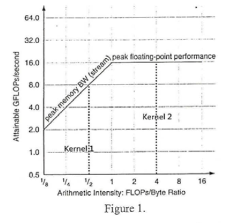

# 111 成大計組系統

1. Determine whether each of the following statements is true (T) or false (F) ?
    - T a. [2%] When a computer has low utilization, they use little power.
    - T b. [2%] Consider the following performance measurement of a program, Computer A has higher MIPS,
    but Computer B is faster.
    $\begin{array}{lll}
    Measurement&Computer A&Computer B \\
    \hline
    Instruction count&10 billion&8 billion \\
    Clock rate&4 GHz&4 GHz\\
    CPI&1.0&1.2\\
    \end{array}$
    - T c. [2%] Suppose the program counter (PC) is at address 0x00000600. It is possible to use one single
    branch-on-equal (beg) MIPS instruction to get to address 0x00020000.
    - F d. [2%] In IEEE 754 single precision floating-point format, the smallest normalized positive number is
    $0000~0001~0000~0000~0000~0000~0000~0000_2$.
    - T e. [2%] The IEEE 754 binary representation of $-0.75_{10}$ is $1011~1111~0000~0000~0000~0000~0000~0000_2$.
    - F f. [2%] Compared with Physically Indexed Physically Tagged (VIPT) cache, the main advantage of
    Virtually Indexed Physically Tagged (VIPT) cache is that it has lower a miss rate.
    - F g. [2%] A fully-associative cache does not have conflict misses.
    - T h. [2%] GPU relies on deeply pipelined architecture to hide long latency of DRAM access latency.
    - F i. [2%] Given the Roofline model in Figure 1, Kernel 1 is memory bandwidth-limited.
    - T j. [2%] It is possible that TLB misses and page fault does not occur.

    >

2. Assume that the following MIPS code is executed on a pipelined processor with a 5-stage pipeline and a predict-taken branch predictor.

    ``` mips
                ADD R2, R1, R3
    Labell :    BEQ R2, RO, Label2 # not taken once, then taken
                LW R3,0(R2)
                BEQ R3, RO, Labell # taken
                ADD R1, R3, RI
    Label2 :    SW R1,0(R2)
    ```

    The actual execution order of instruction is shown as follows:

    ``` mips
    ADD R2, R1, R3
    BEQ R2, RO, Label2 # not taken
    LW R3,0(R2)
    BEQ R3, RO, Labell #taken
    BEQR2,RO, Label2# taken
    SW R1, 0(R2)
    ```

    - a Assume NO forwarding and there are no delay slots. The branch result is determined at the EX stage. On your answer sheet, draw the following table and indicate the cycle at which each instruction is completed, assuming the first instruction is completed at cycle 5 (Hint: Draw the pipeline execution diagram for this code)

        |Execution Order|Completed at cycle?|
        |:-:|:-:|
        |ADD R2,R1,R3|5|
        |BEQ R2,R0,Label|(1)
        |LW R3,0(R2)|(2)|
        |BEQ R3,R0,Label1|(3)|
        |BEQ R2,R0,Label2|(4)|
        |SW R1,0(R2)|(5)|

        Ans:

        | Cycle |     Instruction     | IF | ID | EX | MEM | WB |
        |-------|---------------------|----|----|----|-----|----|
        |   1   | ADD R2, R1, R3      | IF |    |    |     |    |
        |   2   | ADD R2, R1, R3      |    | ID |    |     |    |
        |   3   | ADD R2, R1, R3      |    |    | EX |     |    |
        |   4   | ADD R2, R1, R3      |    |    |    | MEM |    |
        |   5   | ADD R2, R1, R3      |    |    |    |     | WB |
        |   6   | BEQ R2, R0, Label2  | IF | ID |    |     |    |
        |   7   | BEQ R2, R0, Label2  |    |    | EX |     |    |
        |   8   | LW R3, 0(R2)        | IF | ID |    |     |    |
        |   9   | LW R3, 0(R2)        |    |    | EX |     |    |
        |   10  | LW R3, 0(R2)        |    |    |    | MEM |    |
        |   11  | LW R3, 0(R2)        |    |    |    |     | WB |
        |   12  | BEQ R3, R0, Label1  | IF | ID |    |     |    |
        |   13  | BEQ R3, R0, Label1  |    |    | EX |     |    |
        |   14  | BEQ R2, R0, Label2  | IF | ID |    |     |    |
        |   15  | BEQ R2, R0, Label2  |    |    | EX |     |    |
        |   16  | SW R1, 0(R2)        | IF | ID |    |     |    |
        |   17  | SW R1, 0(R2)        |    |    | EX |     |    |
        |   18  | SW R1, 0(R2)        |    |    |    | MEM |    |
        |   19  | SW R1, 0(R2)        |    |    |    |     | WB |

        |Execution Order|Completed at cycle?|
        |:-:|:-:|
        |ADD R2,R1,R3|5|
        |BEQ R2,R0,Label|7|
        |LW R3,0(R2)|11|
        |BEQ R3,R0,Label1|13|
        |BEQ R2,R0,Label2|15|
        |SW R1,0(R2)|19|

    - b Assume FULL forwarding and there are no delay slots. The branch result is determined at the ID stage. On your answer sheet, draw the following table and indicate the cycle at which each instruction is completed, assuming the first instruction is completed at cycle 5 (Hint: Draw the pipeline execution diagram for this code.)

        |Execution Order|Completed at cycle?|
        |:-:|:-:|
        |ADD R2,R1,R3|5|
        |BEQ R2,R0,Label|(1)
        |LW R3,0(R2)|(2)|
        |BEQ R3,R0,Label1|(3)|
        |BEQ R2,R0,Label2|(4)|
        |SW R1,0(R2)|(5)|

        Ans:

        | Cycle |     Instruction     | IF | ID | EX | MEM | WB |
        |-------|---------------------|----|----|----|-----|----|
        |   1   | ADD R2, R1, R3      | IF |    |    |     |    |
        |   2   | ADD R2, R1, R3      |    | ID |    |     |    |
        |   3   | ADD R2, R1, R3      |    |    | EX |     |    |
        |   4   | ADD R2, R1, R3      |    |    |    | MEM |    |
        |   5   | ADD R2, R1, R3      |    |    |    |     | WB |
        |   6   | BEQ R2, R0, Label2  | IF | ID |    |     |    |
        |   7   | BEQ R2, R0, Label2  |    |    | EX |     |    | (R2 value from EX/MEM stage of ADD(3,4))
        |   8   | LW R3, 0(R2)        | IF | ID |    |     |    |
        |   9   | LW R3, 0(R2)        |    |    | EX |     |    |
        |   10  | LW R3, 0(R2)        |    |    |    | MEM |    |
        |   11  | LW R3, 0(R2)        |    |    |    |     | WB |
        |   12  | BEQ R3, R0, Label1  | IF | ID |    |     |    |
        |   13  | BEQ R3, R0, Label1  |    |    | EX |     |    |
        |   14  | BEQ R2, R0, Label2  | IF | ID |    |     |    |
        |   15  | BEQ R2, R0, Label2  |    |    | EX |     |    |
        |   16  | SW R1, 0(R2)        | IF | ID |    |     |    |
        |   17  | SW R1, 0(R2)        |    |    | EX |     |    | (R2 value from EX/MEM stage of BEQ2(13,15))
        |   18  | SW R1, 0(R2)        |    |    |    | MEM |    |
        |   19  | SW R1, 0(R2)        |    |    |    |     | WB |

        |Execution Order|Completed at cycle?|
        |:-:|:-:|
        |ADD R2,R1,R3|5|
        |BEQ R2,R0,Label|7|
        |LW R3,0(R2)|11|
        |BEQ R3,R0,Label1|13|
        |BEQ R2,R0,Label2|15|
        |SW R1,0(R2)|19|

3. Cache are important to providing high-performance memory hierarchy to processo list of 32-bit memory address reference, given as word address 3,180,2,43,191,88,190,14,181,88
    Answer the following questions.  
    - a. Using the above sequence of reference. Assume the cache is direct-mapped with 1-word block a total size of 8 words. Complete the following table by identifying whether each refer miss. What is the hit rate?

    |Addr.|3|180|2|43|191|88|190|14|181|88|
    |:-:|:-:|:-:|:-:|:-:|:-:|:-:|:-:|:-:|:-:|:-:|
    |H/M|Miss|Miss|(1)|(2)|(3)|(4)|(5)|(6)|(7)|(8)|

    Ans:
    |Addr.|3|180|2|43|191|88|190|14|181|88|
    |:-:|:-:|:-:|:-:|:-:|:-:|:-:|:-:|:-:|:-:|:-:|
    |H/M|Miss|Miss|Hit|Miss|Miss|Hit|Hit|Miss|Miss|Hit|

    Hit Rate: 30%

    - b. Using the above sequence of reference, Assume the cache is two-way set associative and block. and a total size of 8 words, used LRU replacement. Complete the follow identifying whether cach reference is hit or miss. What is the hit rate?

    |Addr.|3|180|2|43|191|88|190|14|181|88|
    |:-:|:-:|:-:|:-:|:-:|:-:|:-:|:-:|:-:|:-:|:-:|
    |H/M|Miss|Miss|(1)|(2)|(3)|(4)|(5)|(6)|(7)|(8)|

    Ans:
    |Addr.|3|180|2|43|191|88|190|14|181|88|
    |:-:|:-:|:-:|:-:|:-:|:-:|:-:|:-:|:-:|:-:|:-:|
    |H/M|Miss|Miss|Hit|Hit|Miss|Hit|Hit|Hit|Miss|Hit|

    Hit Rate: 60%

    - c. Using the above sequence of reference. Assume a fully associate cache with two-word blocks and a total size of 8 words. Use LRU replacement. Complete the following table by identifying whether each reference is hit or miss. What is the hit rate?

    |Addr.|3|180|2|43|191|88|190|14|181|88|
    |:-:|:-:|:-:|:-:|:-:|:-:|:-:|:-:|:-:|:-:|:-:|
    |H/M|Miss|Miss|(1)|(2)|(3)|(4)|(5)|(6)|(7)|(8)|

    Ans:
    |Addr.|3|180|2|43|191|88|190|14|181|88|
    |:-:|:-:|:-:|:-:|:-:|:-:|:-:|:-:|:-:|:-:|:-:|
    |H/M|Miss|Miss|Hit|Hit|Hit|Hit|Hit|Hit|Hit|Hit|

    Hit Rate: 80%

4. For a computer system, its main job is input/output (I/O) and processing. In some cases the main job is I/O, and the processing is merely identical. Please answer the following questions related to I/O subsystems of an operating system (OS).
    - a. OS (especially device drivers) interacts with device controllers to perform I/O operations. What kind of commands and data to a device controller can be issued in a device driver to accomplish an I/O transfer? Hint: The commands are often issued in the forms of processor instructions through standard I/O instructions.
        > 1. Control Command
        > 2. Data Transfer Command
        > 3. Status Commands
    - b. A special-purpose processor, called a direct-memory-access (DMA) controller,is often used to offload the burden of a central processing unit (CPU) for handling I/O operations. In such a computer system, the I/O operations can handle by CPU or DMA. Please specify which method (CPU-based or A-based) is suitable for latency-oriented I/O (for small-size data) and explain why.
        >  CPU-based I/O, because DMA has setuptime, and it have to avoid conflict with cpu, so it is more complicated.
    - c. When a DMA controller is used to transfer data, it is often the case that the source and destination addresses of the transfer should be specified in physical memory addresses. Nevertheless, in a system the virtual memory support, the mapping from virtual to physical addresses would be time consuming jobs. What is the hardware device that can be used to help facilitate the mapping process?
        >TLB
    - d. OS provides many services to enhance I/O performance. The descriptions of the three servicted below. Please write down the name of the service (technique) based on its description.
        - i. A memory area that stores data while the data are being transferred from an application to a device.
            >Buffering
        - ii. A region of fast memory that holds copies of data, and access to the copy is more efficient than access to the original data.
            >Caching
        - iii. A memory area that holds output for an I/O device that cannot accept interleaved data streams. Hint: Such an IO device could serve one job at a time.
            >Spooling
    - e. Asynchronous IO can greatly improve I/O throughput in a computer. Which technique(s) (of the three services/techniques mentioned in the above question) can be adopted to implement an efficient asynchronous IO operation? Explain your answer.
        >By using buffering and callbacks
        >1. when an application initiates an asynchronous I/O operation, the OS copies the data to a buffer and then initiates the I/O transfer.
        >2. The application then notified via a callback when the I/O transfer is complete. This made application no need waiting for I/O operation.
    - f. A swap space is often created by using disk space as an extension of main memory. In practice, a swap space can craved from the two approaches: a file system or a separate disk partition. Which approach can be used when the implementation efficiency is desired? Explain your answer.
        >Separate disk partition, because using a file system as a swap space can make it mor time-consuming in case of the need for file system operations.
    - g. What phenomenon will occur if a computer system is assigned with a fixed swap space and the degree of multiprogramming is increasing (by introducing new processes to the system)? Explain your answer.
        >1. memory swapping frequency increase
        >2. Page fault will increase
        >3. CPU load will increase
    - h. Continue with the above question. The working-set model is proposed as a measure to prevent the above phenomenon from happening. We suppose a system with three processes, A, B, and C, and their working-set sizes (WSS) are WSS(a), WSS(b), and WSS(c), respectively. Also, we suppose the swap-space size of d. In what situation will OS suspend a process to improve the system performance? Please use a mathematical formula to define the situation with the relationship of WSS(a), WSS(b), WSS(c), and d.
        > I DON'T KNOW
    - i. Scheduling of disk I/O requests in a good order would greatly improve I/O efficiency. Given a multiprogramming environment with concurrent I/O, which disk scheduling family (among FCFS, SCAN, and LOOK families) will perform better? Explain your answer.  
        >Look families,beacuse LOOK algorithms consider the direction of the disk head movement, which can reduce seek time and improve overall I/O performance.
    - j Continue with the above question. When the disk queue size is set to one, which disk scheduling family will perform better? Explain your answer.
        >FCFS, because when n is 1,then n^2 < 2n
