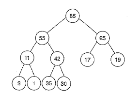
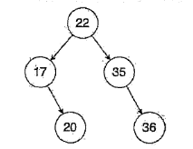
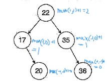
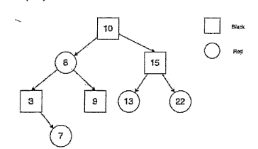
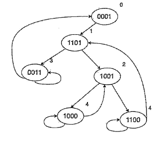
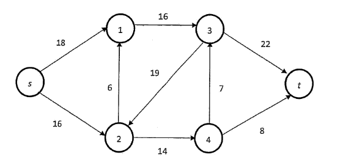

# 成大

@Yunitrish006006

- 2.Consider a key-value (KV) storage. A KV pair stored in the storage consists of a constant length of an
alphabetical string as a key, and its associated value is simply a variable-length bit string, The KV
storage provides PUT (x, v) and v=GET (x) APIs to applications, where PUT (x,v) stores a key-
value pair in the storage with the designated key x and value v, and GET (x) returns the vaiue y,
given the queried key  x, previously stored in the KV store. Additionally, SCAN (x1 ,x2) offered
by the KV storage retums a list of KV pairs such that the koys of the retrieved data items are no less
than xe1 and no greater than x2. Let the KV storage be operated in a computer system equipped with
sizes of x volatile memory space and of y persistent storage, where x < y.
Notably, applications may introduce two types of workload patterns to the KV storage. The random
access patter denotes keys generated by GET (.), PUT(.) and SCAN(. )  are random, while the
seguential access represents the scenario that data items are addressed with increasing (or decrcasing)
keys. Secondly, GE' (.), PUT(.) and SCAN (. ) operations can be performed concurrently on the
fly by the KV store. Thirdly, the total storage size of KV pairs stored in the system may be greater
than x, the available volatile memory space as aforementioned. Finally, the KV storage may fail
anytime and support the recovery for committed PUT ( . ) operations.
Please discuss designs and implementations of operating systems to provide such a KV storage
service, considering to optimize the performance metrics in terms of delays and throughputs in
manipulating GET(.), PUT (.) and SCAN(.) operations. You shall state clearly subject to the
following techniques in order.
  - (1) [5%] In-memory indexing
    Employ in-memory indexing to quickly locate KV pairs based on their keys, significantly reducing the time required for random access operations
  - (2) [5%] In-disk indexing
    Utilize an in-memory index to accelerate random access operations and a secondary in-disk index for sequential access, enabling efficient retrieval of consecutive KV pairs.
  - (3) [5%] Caching
    Implement a caching mechanism to store frequently accessed KV pairs in memory, reducing the overhead of accessing them from the slower persistent storage. This approach can significantly improve the throughput and reduce latency for frequently used data.
  - (4) [5%] Paging
    Implement paging to manage the limited volatile memory space. Data that is less frequently accessed can be swapped out to persistent storage, making room for more frequently used KV pairs.
  - (5) [5%] Batched I/O
    Batched I/O: Optimize I/O operations by batching together multiple PUT, GET, and SCAN requests before writing or reading data from persistent storage. This can significantly reduce the overhead of individual I/O operations.
  - (6) [5%] Multithreading and thread scheduling
    Multithreading and thread scheduling: Employ multithreading and efficient thread scheduling to handle concurrent access to the KV storage. Different threads can handle separate PUT, GET, and SCAN operations, improving overall throughput.
  - (7) [5%] Shared memory and consistency
    Shared memory and consistency: Utilize shared memory for data that is frequently accessed by multiple threads. This can significantly reduce contention and improve performance, especially for concurrent operations. However, it's crucial to ensure data consistency using appropriate synchronization mechanisms.
  - (8) [5%] Encoding/Decoding
    Optimize data encoding and decoding to minimize the amount of data transferred between memory and persistent storage. This can reduce I/O overhead and improve overall performance.
  - (9) [5%] File system block layout
    Carefully design the file system block layout to optimize data access patterns. This can improve the efficiency of random and sequential reads and writes.
  - (10) [5%] File system compaction
    Implement file system compaction techniques to efficiently reclaim space from deleted or overwritten KV pairs. This can reduce fragmentation and improve overall storage utilization.

1. [A、B] Which of the following statements is (are) correct ?
    - (A) Searching a particular data item in a binary search tree with n nodes requires at most log2(n+1) comparisons.
    - (B) A full binary tree of a given height h has 26-1 nodes. (The root is at height of 1.)
    - (C) Represent a binary tree in an one-dimensional array (say, a[]). Assume the root is stored in a[1]. Then, the index of node i's parent is floor(i/2).
    - (D) AVL, red-black tree and compressed trie are binary trees.
2. [A、D、E] The following graph is a maximum heap. After removing the maximum element, which of the followings is (are) true ?
    >
    - (A) 30 is a leaf node in the resultant heap after removal.
    - (B) Suppose we use an array to implement the heap. The $5^{th}$ element in the array is 30.
    - (C) In the post-order traversal, 55 is before 42.
    - (D) 25 is at same indexing position in the array for the post-order and in-order traversals.
    - (E) The complexity of removal is O(log n), where n is the number of data items in the heap.

    post-order: 3,1,11,30,35,42,17,19,25,55

    in-order:   3,11,1,42,30,35,55,17,25,19

3. [B、D] Given a graph G as depicted as follows. T is minimum spanning tree (MST) of G. Which of the following descriptions is (are) true?
    - (A)Perform Prim's algorithm to find the MST, starting from node L. The last edge included into the MST is (A, B).
    - (B) The minimum spanning tree for G is unique.
    - (C) If let G2 be G by excluding the edge (M, E), then the G2's MST is identical to G's.
    - (D)Let G3 be G2 removing the edge (B, F). The MSTs' of G2 and G3 are identical.

4. [A、C] Given an AVL tree as follows, we perform the operations (A), (B), (C), (D) and (E), independently.Which of these operations would result in the tree to be unbalanced, and shall be restructured?

    
    - (A) insert 18
    - (B) insert 33
    - (C) insert 38
    - (D) delete 35
    - (E) delete 22

    Ans:
    
    [教學](https://josephjsf2.github.io/data/structure/and/algorithm/2019/06/22/avl-tree.html)

5. [B、C] Suppose we have a Red-Black tree as shown below. Let us insert 6, 14 and 11 in order. Which of the following statements is (are) correct?

    
    - (A) The resultant Red-Black tree contains 6 red nodes.
    - (B) The color of node of value 8 is black.
    - (C) The color of node of value 14 is red.
    - (D) The parent's value of node of value 7 is 3.
    - (E) The children of node of value 10 are red nodes.

    Ans:
    [教學](https://josephjsf2.github.io/data/structure/and/algorithm/2020/04/28/red-black-tree-part-1.html)

6. [A、C] Which of the following statements is (are) correct?
    - (A) The maximum number of data items stored in an m-way search tree is m'-1, where h is the height of the tree.
    - (B) An 2-3-4 tree is a B-tree of order 5.
    - (C) Any internal node (excluding the root) has at a least ceil(m/2) children in an B-tree of order m.
    - (D) The external nodes on the same level in an B-tree.
    - (E) An Red-Black tree is a binary tree form of an 2-3 tree.

    - Ans:
        !!m-way's root is from 1
        - B => *B tree of order 4.
        - D => between m/2 and m data items, so not sure if is in same level.
        - E => no need explanation.

7. [DE] A hash table in size of 10 adopts open addressing with linear probing, where its hash function is defined as h(k) = k % 10. The table is initially empty. We insert 6 data items into the table, resulting in the following table. Which of the following choices gives a possible order for inserting the data items to the table?
    - (A) 32, 14, 53, 26, 22, 43
    - (B) 42, 22, 13, 26, 53, 32
    - (C) 22, 43, 14, 32, 53, 26
    - (D) 43, 22, 14, 26, 32, 53
    - (E) 14, 43, 22, 32, 26, 53

    - Ans:
      根據此圖判斷，32、53自動往後移位，其他均在正確位置，因此 32、53都要在序列最後方，又53必須先無法在5的位置，53才能往後移到7的位置，因此 32 在 53 之前，故答案為D

8. [A、B、D、E] Consider an Min-Max heap represented as an array [3, 20, 13, 6, 5, 4, 8, 10, 15, 12, 9, 7]. If we exchange any two values X and Y in the array, which of the choices is (are) NOT Min-Max heap(s)?  

    ``` min max heaps
              3
          /        \
        13          6
       /  \        / \
      5    4      8  10
     / \  / \    / \
    3  9 15 12  7
    ```

    - (A) 5  and 7
    - (B) 4  and 9
    - (C) 8  and 9
    - (D) 13 and 9
    - (E) 5  and 10

    - Ans: [教學](https://hackmd.io/@vRN1CwEsTLyHOsG4mC0d4Q/HyxgysfhN)

9. [A] Suppose we have a Patricia trie as shown below. Let us insert 0110 into and then delete 1100 from the trie. What does node 1101 point to?
    
    - (A) 0001
    - (B) 0110
    - (C) 0011
    - (D) 1001
    - (E) 1000

    - Ans:
      before insert 0110，node 1101 => node 0001。after delete 1100，node 0001 's sub node 1100 will disapear。Thus，node 1101 => node 0001。  
      insert 0110：  
        >node 1101's sub node 0011's sub node 0110 will redirect to 0110。  
      delete 1100：  
          >node 0001 's sub node 1100 deleted。  
          >thus，node 1101 => node 0001。  
      thus => (A) 0001。

10. [(A)、B、C、(E)] Please identify which of the following statement(s) is (are) true.
(A) Tries outperform digital search trees in terms of the number of comparison operations performed.
(B) Compared with tries, compressed tries take less storage overheads.
(C) Patricia outperforms compressed tries in terms of storage overheads.
(D) Both Patricia and digital search trees take the identical complexity of storage overheads.
(E) Patricia outperforms digital search trees in terms of the number of comparison operations performed.

11. (10%) Use the master method to give tight asymptotic bounds for the following recursive $T(n) = 27T(n/3) + 0(n^3/lgn)$. (Assume that T(n) is a constant for sufficiently small n.)
    - Ans:  
      T(n) = 27T(n/3) + Θ(n^(3/2))  
      c = 27  
      a = 3/2  
      if a > 1，then T(n) = Θ(n^c)  
      if 1 < a < 1 + log_2 c，then T(n) = Θ(n^(a log_2 c))  
      if 0 < a < 1，then T(n) = Θ(n^(a log_2 c) * log n)  
      => T(n) = Θ(n^(3/2))

12. (10%) The following procedure is a bottom-up method for matrix chain order. This procedure assumes that matrix $A_i$ hasdimensions $p_{i-1} \times p_i $ for i = 1,2,...,n. Its input is a sequence $p = (p_0,p_1,...,p_n)$, where p.length = n + 1. Let m[i, j] be the minimum number of scalar multiplications needed to compute the matrix $A_iA_{i+1}...A_j$. The procedure uses an auxiliary table m[1..n, 1..n] for storing the m[i,j] costs and another auxiliary table s[1..n - 1,2..n]that records which index of k achieved the optimal cost in computing m[i, j]. Please fill in the empty statements.

    ``` psuedo code
    n = p.length - 1
    let m[1..n,1..n] and s[1..n-1,2..n] be new tables
    For i = 1 to n
      m[i,i] =0
    For l = 2 to n // l is the chain length
      For i = 1 to n-l+1
        j= __(a)"i + l - 1"__
        m[i,j]= ∞
        For k = i to j-1
          q = __(b)"m[i,k] + m[k+1,j] + p[i-1]*p[k]*p[j]"__
          If q < m[i,j]
            m[i,j] = q
            s[i,j] = __(c)"k"__
    ```

13. Illustrate the operation of HEAPSORT on the array S=[5, 13, 2, 25, 7, 17, 20, 8, 4]

    ``` heap tree
             25
           /    \
         13     20
        / \    /  \
       2   5  17   8
      / \
     7   4
    ```

    ``` heap tree
    25 out 4 to top
           20
          /   \
         13    17
        / \    /  \
       2   5  4   8
      /
     7   
    ```

    ``` heap tree
    20 out 7 to top
            17
          /    \
         13     7
        / \    /  \
       2   5  4   8
    ```

    ``` heap tree
    17 out 8 to top
            13
          /    \
         8      7
        / \    /
       2   5  4
    ```

    ``` heap tree
    13 out 4 to top
            8
          /   \
         4     7
        / \
       2   5
    ```

    ``` heap tree
    8 out 5 to top
            7
          /   \
         4     5
        /
       2
    ```

    ``` heap tree
    7 out 2 to top
            5
          /   \
         4     2
    ```

    ``` heap tree
    5 out 2 to top
            4
          /
         2
    ```

    ``` heap tree
    4 out 2 is the last one
          
          2
    ```

    [25,20,17,13,8,7,5,4,2]
14. (10%) We are given a sequence $K = (k_1, K_2,.., k_n)$ of n distinct keys in sorted order (so that $k_1 < k_2 < ... < k_n$), and we wish to build a binary search tree from these keys. For each key ki, we have a probability pi that a search will be for Ki. Some searches may be for values not in K, and so we also have n + 1 "dummy keys" do,d1,...,dn representing values not in K. In particular, do represents all values less than k1, d0 represents all values greater than kn, and for i= 1,2, ...n- 1, the dummy key $d_i$ represents all values between $k_i$ and $k_{i+1}$. For each dummy key $d_i$, we have a probability qi that a search will correspond to  di. Determine the cost and structure of an optimal binary search tree in the expected cost of search time for a set of n = 7 keys with the following probabilities:
    | i |   0   |   1   |   2   |   3   |   4   |   5   |   6   |   7   |
    |:-:|:-----:|:-----:|:-----:|:-----:|:-----:|:-----:|:-----:|:-----:|
    |pi |       |  0.04 |  0.06 |  0.08 |  0.02 |  0.10 |  0.12 |  0.14 |
    |qi |  0.06 |  0.06 |  0.06 |  0.05 |  0.05 |  0.05 |  0.05 |  0.06 |

    - Ans:
        1.70

15. (10%) The following graph is about the maximum flow problem. Each edge is labeled with its capacity. What is the maximum flow from vertex s to vertex t.
    

    - Ans:
      - 
      跑完program得出30
