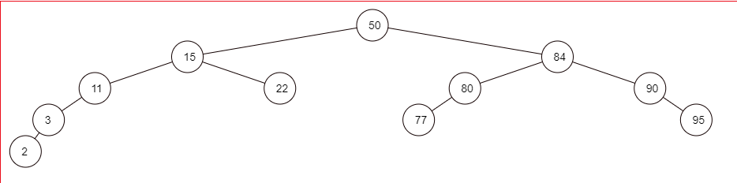
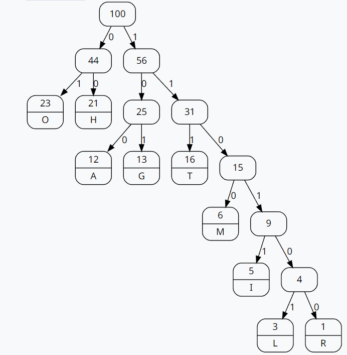
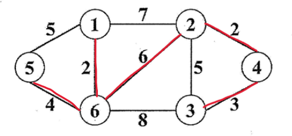

# 110 成大程式設計

1. Ans:
    - 
2. Ans:
    - 
3. Ans:
    - (1) use ASCII value sum mod 11
        - abcdef,bcdefa,cdefab,defbac 's sum is all the same
        - 3 collision
    - (2) every character times ASCII value sum mod 11
        - abcdef = $(1*97 + 2*98 + 3*99 + 4*100 + 5*101 + 6*102) mod 11 = 2107 mod 11 = 6$
        - bcdefa = $(6*97 + 1*98 + 2*99 + 3*100 + 4*101 + 5*102) mod 11 = 2092 mod 11 = 2$
        - cdefab = $(5*97 + 6*98 + 1*99 + 2*100 + 3*101 + 4*102) mod 11 = 2083 mod 11 = 4$
        - defabc = $(4*97 + 5*98 + 6*99 + 1*100 + 2*101 + 3*102) mod 11 = 2080 mod 11 = 1$
        - 0 collision
4. Ans:
    - (1)
        - 先"假設"sum初始值為0
        - 第一個for:1+2+3+4+5+6+7+8 = 36
        - 第二個for:4+3+2+1 = 10
        - 答案 = 36+10 = 46
    - (2) O(n)
5. 
6. Ans:
    - [驗證網站](https://www.nayuki.io/page/master-theorem-solver-javascript)
    - [Master Therom](https://en.wikipedia.org/wiki/Master_theorem_(analysis_of_algorithms))
    - (1) $\Theta(\sqrt{n}logn)$
    - (2) 無法計算，b必須比1大($log_ba$無法成立)
    - (3) $\Theta(nlogn)$
    - (4) $\Theta(n^2log^2n)$
    - (5) $\Theta(n^{log_27})$
7. Ans:
    - (1) T
    - (2) F If A can be reduce to a problem B，then B is not NP-complete (定義不符)
    - (3) T
    - (4) F there "maybe" exist
    - (5) T
8. Ans:
    - (1)

        ``` psuedo code
            (x[i - 1] == z[0]);
        ```

    - (2)

        ``` psuedo code
            (y[j - 1] == z[0]);
        ```

    - (3)

        ``` psuedo code
            (S[i - 1][j] && (x[i - 1] == z[i + j - 1])) || (S[i][j - 1] && (y[j - 1] == z[i + j - 1]));
        ```

9. Ans:
    - (1) $O(n^3)$
    - (2) $min(d_{ik}^{k-1} + d_{kj}^{k-1}, d_{ij}^{k-1})$
    - (3) $dist(1,5) + dist(2,5) + dist(3,5) + dist(4,5) + dist(6,5) = 15 + 12 + 7 + 4 + 4 = 42$
