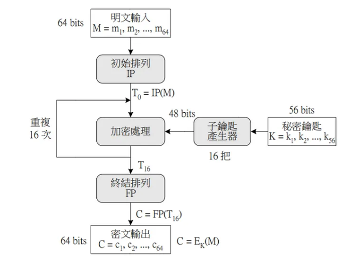

# 110 中興資工乙組資訊概論

1. Ans:
    - b: 因為該陣列中不一定照順序，所以可以用順序找出數字，但不能直接去找一個特定的值。
2. Ans:
    - b
3. Ans:
    - b
4. Ans:
    - d
5. Ans:
    - d
6. Ans:

    ``` python
        def disjoint(array1, array2):
            array1.sort()
            array2.sort()
            for i in range(len(array1)):
                if array1[i] == array2[i]:
                return False
            return True
        
        #驗證:
        array1 = [1, 2, 3, 4, 5]
        array2 = [6, 7, 8, 9, 10]

        print(disjoint(array1, array2))
    ```

7. Ans:
    - (1) Polling
    - (2) interrupt
8. Ans:
    - (1) interrupt
    - (2) I/O or event wait
    - (3) Event or I/O completion
9. Ans:
    - (a) 檢測非法記憶體訪問的步驟如下：  
        操作系統首先會在進程的頁表中查找對應的頁面映射。  
        如果頁面映射存在，則操作系統會檢查頁面是否具有訪問權限。  
        如果頁面映射不存在，或者頁面沒有訪問權限，則操作系統會產生一個異常。
    - (b) 非法記憶體訪問是由操作系統檢測的。操作系統使用頁表來跟踪進程的記憶體訪問。  
        當進程嘗試訪問記憶體時，操作系統會首先在頁表中查找對應的頁面映射。  
        如果頁面映射存在，則操作系統會檢查頁面是否具有訪問權限。  
        如果頁面映射不存在，或者頁面沒有訪問權限，則操作系統會產生一個異常。  
        在本例中，操作系統會在進程的頁表中查找頁面 6 的映射。由於該映射不存在，操作系統會產生一個異常。  

10. Ans:
    - 在程式碼進入臨界區之前，鎖的狀態可能會被另一個執行緒改變。例如，如果執行緒 A 在程式碼進入臨界區之前將鎖的狀態設置為 1，那麼執行緒 B 將無法進入臨界區，即使執行緒 A 已經完成了臨界區的操作並將鎖的狀態設置為 0。
    - 這個問題，可以用互斥鎖解決，互斥鎖是一種可以由一個執行緒同時持有的鎖。當一個執行緒持有互斥鎖時，其他執行緒將無法訪問臨界區。

11. Ans:
    系統先將資料搬移到暫存區，再從暫存區搬到目標位置，這樣可以避免因為搬移到一半取消而造成的檔案損毀。

12. Ans:
    - Confusion: 使cipher和key的關係盡量混亂複雜，使攻擊者難以猜出
    - Difusion: 當plain text的相似程度相當高的時候，cipher text也要做出明顯差異

13. Ans:
    - 
    - 3 rounds

14. Ans:
    - AddRoundKey: 矩陣中的每一個位元組都與該次回合金鑰（round key）做XOR運算；每個子金鑰由金鑰生成方案產生
    - SubBytes: 透過一個非線性的替換函數，用尋找表的方式把每個位元組替換成對應的位元組
    - ShiftRows: 將矩陣中的每個橫列進行循環式移位。
    - MixColumns: 為了充分混合矩陣中各個直行的操作。這個步驟使用線性轉換來混合每行內的四個位元組。最後一個加密迴圈中省略MixColumns步驟，而以另一個AddRoundKey取代

15. Ans: 不確定
    - a. $(x^3 + x^2 + x + 1) * (x^2 + x + 1)
       \\ = x^5 + x^4 + x^3 + x^2 + x + 1 $
    - b. $(x^3 + x^2 + 1) * (x^2 + 1)
        \\ = x^5 + x^4 + x^3 + x^2 + 1$

16. Ans:
    | Algorithm | Best | Average | Worst |
    |:---------:|:----:|:-------:|:-----:|
    | Insertion |   n  |  $n^2$  | $n^2$ |
    |   Quick   | nlogn|  nlogn  | $n^2$ |
    |   Merge   | nlogn|  nlogn  | nlogn |
    |    Heap   | nlogn|  nlogn  | nlogn |

17. Ans:
    - Stable soring: 同鍵值的資料，排序後順序和排序前一樣
    - In-place: 使用資料原來的資料結構(陣列)進行排序，不需使用暫存的輔助資料結構
18. Ans:
    - a: T
    - b: F 不能只跑一次
    - c: T
19. Ans:
    - P: 指在多項式時間內，可以找出解的決定性問題(decision problem)。
    - NP: 包含可在多項式時間內驗證其解是否正確，但不保證能在多項式時間內能找出解的決定性問題。
