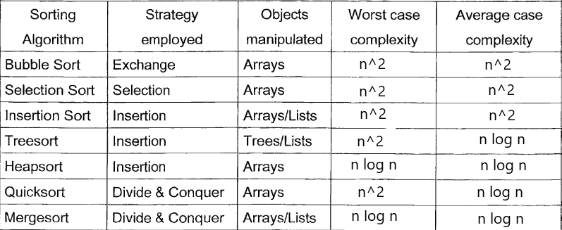
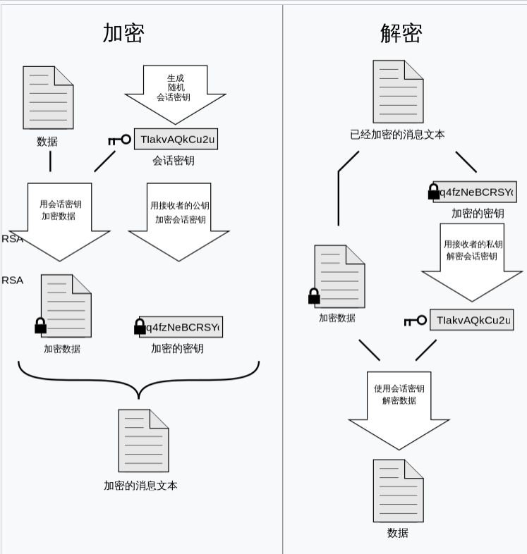
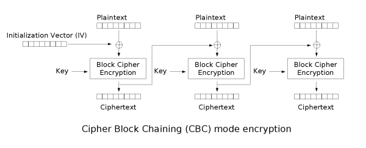
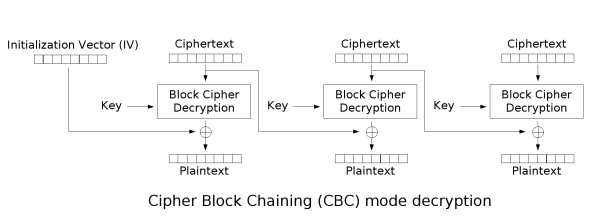

# 109 中興乙組資訊概論

1. Ans:
    - (1) 14
    - (2) 34
    - (3) 4
    - (4) true
    - (5) false

2. Ans:

    ``` code
        double median(double x, double y, double z) {
            double mid;
            if (x <= y) {
                if (y <= z) {
                mid = y;
                } else {
                mid = z;
                }
            } else {
                mid = x;
            }
            return mid;
        }
    ```

3. Ans:
    - (1) (0,1,3,0,2,3,0)
    - (2) (0,1,2,5,3,0,5)
    - (3)、(4)

        ``` python
            def next_permutation(nums):
                i = len(nums) - 2
                while i >= 0 and nums[i] >= nums[i + 1]:
                    i -= 1

                if i < 0:
                    return nums[::-1]

                j = len(nums) - 1
                while nums[i] >= nums[j]:
                    j -= 1

                nums[i], nums[j] = nums[j], nums[i]
                nums[i + 1:] = nums[i + 1:][::-1]
                return nums

            def previous_permutation(nums):
            i = len(nums) - 2
            while i >= 0 and nums[i] <= nums[i + 1]:
                i -= 1

            if i < 0:
                return nums[::-1]

            j = len(nums) - 1
            while nums[i] <= nums[j]:
                j -= 1

            nums[i], nums[j] = nums[j], nums[i]
            nums[i + 1:] = nums[i + 1:][::-1]
            return nums

            nums = list(map(int, input().split()))
            print("next: "+ str(next_permutation(nums)))
            print("prev: "+ str(previous_permutation(nums)))
        ```

4. Ans:
    - 

5. Ans:
    - (a) iii
    - (b) iii
    - (c) ii
    - (d) iii
    - (e) i

6. Ans:
    - (a) iii、iv
    - (b) i、iv
    - (c) i、iv
    - (d) i、ii、iii、iv
    - (e) ii、iv

7. 

8. Ans:
    - 每個明文塊先與前一個密文塊進行互斥或後，再進行加密。在這種方法中，每個密文塊都依賴於它前面的所有明文塊。同時，為了保證每條訊息的唯一性，在第一個塊中需要使用初始化向量。
    - 
    - 
