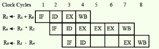
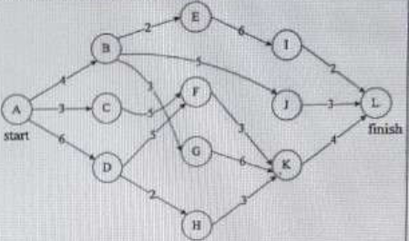
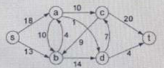
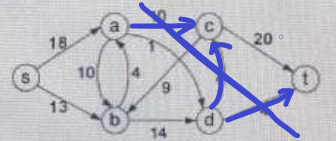
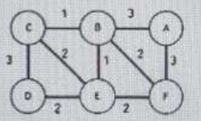

# 110 甲組

## Part I

### 1. 單選題

A. (b) Please indicate which of the following scheduling algorithm is non-preempitive?

- (a) Round Robin
- (b) First-in First-out
- (c) Multilevel Queue Scheduling
- (c) Multilevel Queue Scheduling with feedback

B. (d) Please find which of the following statement are true:

> I shortest remaining time first scheduiling may bring about starvation
>
> II Preempitive scheduling may bring about starvation
>
> III Round Robin is better than FCFS in terms of reponsive time

- (a) I only
- (b) I and III only
- (c) II and III only
- (d) I, II and III

C. (d) Please indicate why a multilevel page table is preffered in comparison to a single page table for translate virtual address to physical address:

- (a) It reduces the memory access time to read or write a memory location.
- (b) It helps to reduce the size of page table needed to implement the vitural address space of a progress.
- (c) It is required by the transition look aside buffer.
- (d) It helps to reduce the number of page faults in page replacement algorithms.

D. (c) Suppose the following table og arrival time and burs time for three processes P0, P1 and P2

Process | Arrival time | Burst Time |
:------:|:------------:|:----------:|
P0      |0ms           |9ms         |
P1      |1ms           |4ms         |
P2      |2ms           |9ms         |

We adopt the pre-emptive shortest job first scheduling algorithm and scheduling is carried out only at arrival or completion of processes what is the average waiting time for the three processes?

- (a) 5.0ms
- (b) 5.5ms
- (c) 6.5ms
- (d) 7.0ms

詳解:

Time|Process|
:-:|:-:|
0|P0|
1|P1|
3|P2|
5|P0|
6|P1|
7|P2|
8|P0|
9|P1|
10|P2|

P0: 1ms + 4ms + 3ms = 8ms

P1: 3ms + 3ms = 6ms

P2: 5ms + 2ms = 7ms

### 2.單選題

A. (a)Giving a process to execute the following code " for (i=0;i<n;i++;) fork();"
what is the total numner of child process created?

- (a) $n$
- (b) $2^n$
- (c) $2^n-1$
- (d) $2^{n+1}-1$

B. (c)Which of the followinf statement is not true of deadlock prevention and deadlock avoidance schemes?

- (a) In deadlock prevention, the requset for resources is always granted if the resulting state is safe
- (b) In deadlock avoidance, the request for resources is always granted if the result state is safe
- (c) Deadlock avoidance is less restrictive than deadlock prevention
- (d) Deadlock avoidance requires knowledge of resource requirements a priori

C. (c)Suppose a vitural memory system with FIFO page replacement policy. For an arbitray page access activity, if we increase the number of page frames in main memory,

- (a) it will always decrease the number of page faults
- (b) it will always increase the number of page faults
- (c) it will sometimes increase the number of page faults
- (d) it never affect the number of page faults

D. (d)Please find which of the following statement is false

- (a) Virtual memory implements the translation of a program's address space into physical memory address space
- (b) Virtual memory allows each program to exceed the size if the primary memory
- (c) Virtual memory increases the degree of multiprogramming
- (d) Virtual memory reduces the context switching overhead

### 3.單選題

A. (a)Suppose a machine with 64MB physicak memory abd a 32 =-bit vitural address space, If the page size is 4KB, then find the appoiximate size of the page table:

- (a) 2MB
- (b) 4MB
- (c) 8MB
- (d) 16MB

B. (c)Giving a CPU to generate 32-bit vitural addresses. Suppose the page size is 4 KB and the processor has a translation look-aside buffer (TLB) which can hold a total of 128 page table table entries and is 4-way set assiciative.The minium size of the TLB is:

- (a) 9 bits
- (b) 11 bits
- (c) 15 bits
- (d) 20 bits

C. (c)Please indicate why increasing the RAM size of a computer typically improves performance:

- (a) Virtual memory increases
- (b) Larger RAMs are faster
- (c) Fewer page faults occur
- (d) Fewer segmentation faults occur

✓D. (c)In an instruction execution pipeline, the earliest that the data TLB(Translation Look-aside Buffer) can be accessed is

- (a) before effective address calculation has started
- (b) during effective address calculation
- (c) after effective address calculation has completed
- (d) after data cache lookup has completed

### 4.單選題

✓A. (b) Which of the following statements are not true in a pipelined processor?
I.Bypassing can handle all RAW hazards
II.Register renaming can be eliminated all register carried WAR hazzards
III.Control hazard penalties can be eliminated by dynamic branch prediction

- (a) I and II only
- (b) I and III only
- (c) II and II only
- (d) I, II and III

B. (c) Register renaming is used in pipeline processor

- (a) as an alternative to register allocation at compile time
- (b) for efficient access to function parameters and local variables
- (c) to handle certain kinds of hazards
- (d) as part of address translation

C. (d)Giving the sequence of micro-operaions as following shows:

MBR <- PC

MAR <- X

PC <- Y

Memory <- MBR

MBR: Memory Buffer Register, Mar: Memory Address Register, PC: Program Counter

Which one of the following is a possible operation performed by this sequence?

- (a) Instruction fetch
- (b) Operand fetch
- (c) Conditional branch
- (d) initiation of interrupt service

D. (a)Suppose there is two cache levels L1 and L2 in a multi-level cache hierarchy, which of the following are necessary?

I.L1 must be a write through cache

II.L2 must be a write through cache

III.The associativity of L2 must be greater than that of L1

IV.The L2 cache must be at least as large as the L1 cache

- (a) IV only
- (b) I and IV only
- (c) I, III and IV only
- (d) I, II, III and IV

### 5.單選題

A. (b) Assume a pipelined processor with the following four stages:

IF: Instruction Fetch

ID: Instruction Decode and Operand Fetch

EX: Execute

WB: Write Back

The IF, ID and WB statges take one clock cycle each to complete the operation, The number of clock cycles for the statge depends on the instruction. The ADD abd SUB instructions need 1 clock cycle and the MUL instruction needs 3 clock cycles in the EX stage. Operabd forwarding is used in the pipelined processor. What is the number of clock cycles taken ti complete the following sequence of instrucions?

ADD R2,R1,R0 R2<-R0+R1

MUL R4,R3,R2 R4<-R3*R2

SUB R6,R5,R4 R6<-R5-R4

- (a) 4
- (b) 8
- (c) 12
- (d) 16

詳解:

struction   |IF|ID|EX|WB|Total|
:------:|:-:|:-:|:-:|:-:|:---:|
ADD R2,R1,R0|1 |1 |1 |1 |  4  |
MUL R4,R3,R2|1 |1 |3 |1 |  6  |
SUB R6,R5,R4|1 |1 |1 |1 |  4  |

Clock cycle | IF | ID | EX | WB |    |
:----------:|:--:|:--:|:--:|:--:|:--:|
0       | ADD R2,R1,R0 |   |    |    |
1       | MUL R4,R3,R2 | ADD R2,R1,R0 |   |   |
2       | SUB R6,R5,R4 | MUL R4,R3,R2 |   |   |
3       |   | SUB R6,R5,R4 | MUL R4,R3,R2 |   |
4       |   |   | SUB R6,R5,R4 | ADD R2,R1,R0 |
5       |   |   |   | MUL R4,R3,R2 |
6       |   |   |   | SUB R6,R5,R4 |

B. (a)Which of the following is true?

- (a) A processor checks for interrupts before executing a new instruction.
- (b) Loop instructions cannot be interrupted till they complete.
- (c) A CPU will not be able to process interrupts unless it is enabled.
- (d) Only level triggered interrupts are possible in microprocessors.

C. (d) Which of the following statement is true?

- (a) A virtual memmory system adopts write through strategy
- (b) Because of its higher density, NAND FLASH is used mainly for data storage applications and it alseo can be random access.
- (c) The structure hazzard is arising from the need to make a decision based on the results of one instruction while other are executing
- (d) It is possible to have a TLB hit and a data cache miss for the same data reference

D. (d) Which of the following statement is true?

- (a) Programmed I/O uses fewer CPU resources than DMA
- (b) Using mutual exclusion ensures that a system avoids deadlock
- (c) A context switch takes place at every system call
- (d) Software interrupt is synchronous with the current process.

## Part II 資料結構與演算法

### 6.單選題

A. (c) Consider the following function that takes reference to head of a Doubly Linked List as parameter. Assume that a node of doubly linked kust has previous pointer as prev and next pointer as next.
>
> void fun(struct node **head_ref) {
>> struct node *temp = NULL;
>>
>> struct node *current=*head_ref;
>>
>> while (current != NULL) {
>>>
>>> temp = current->prev;
>>>
>>> current -> prev = current -> mext;
>>>
>>> current -> next = temp;
>>>
>>> current = current->prev;
>>>
>>}
>>
>> if (temp != NULL) *head_ref = temp->prev;
>>
>}

Assume that reference of head of following doubly linked list is passed above function
1<->2<->3<->4<->5<->6. What should be the nodified linked after the function call?

- (a) 2<->1<->4<->3<->6<->5
- (b) 5<->4<->3<->2<->1<->6
- (c) 6<->5<->4<->3<->2<->1
- (d) 6<->5<->4<->3<->1<->2
- (e) 5<->4<->2<->3<->1<->6

B. (e) A hash table of length 10 uses open addressing with hash function h(k) = k mod 10
, and linear probing. After inserting 6 values into an empty hash table, the table is as shown below. Which one of the following choices gives a possible order in which the key values could have been inserted in the table?
xx|xx|
:-:|:--:|
 0 |    |
 1 |    |
 2 | 42 |
 3 | 23 |
 4 | 34 |
 5 | 52 |
 6 | 46 |
 7 | 33 |
 8 |    |
 9 |    |

- (a) 46,42,34,52,23,33
- (b) 34,42,23,52,33,46
- (c) 42,46,33,23,34,52
- (d) 23,34,42,52,33,46
- (e) 46,34,42,23,52,33

C. (a)Assume that the following numbers are sequentially inserted into an empty Red-Black tree: 40, 60, 55, 15, 20, 5, 25, 30. What is the sum of the numbers in the red nodes of the Red-Black tree.

- (a) 90
- (b) 130
- (c) 155
- (d) 160
- (d) none of the above

### 7.單選題

A. (b)What are the appropriate data structures for following algorithms?

1. Breadth first Search
2. Depth first Search
3. Prim's Minimum Spanning Tree
4. Kruskal's Minimum Spanning Tree

- (a) stack, queue, priority queue, union Find
- (b) queue, stack, priority queue, union Find
- (c) stack, queue, union Find, priority queue
- (d) priority queue, queue, stack, union Find
- (d) queue, stack, stack, union Find

B. (c) Please select the correct sttement for the post-order traversal sequence of the binary tree below.

              A
            /   \
          B     C
        /     /   \
        D     F     G
      / \   / \
      H   I E   J

- (a) Node A appears between node B and node C
- (b) Node B appears in the second position
- (c) Node F appears immediately before node G
- (d) Node J is traversed after node C
- (e) The first four nodes in the sequence are all-leaf nodes.

詳解: H I D B E J F G C A

C. (d) We input the following numbers, 34, 44, 62, 29, 56, 61, 100, into an  array-based max heap. What is the final sequence of numbers in the array?

- (a) (34,61,44,29,62,56,100)
- (b) (100,62,61,56,44,34,29)
- (c) (29,34,44,56,61,62,100)
- (d) (56,61,62,44,29,34,100)
- (e) (29,44,34,56,61,62,100)

詳解:

             100
          /       \
         62       56
        /  \     /  \
       29  61
      /
     34

D. (a) Please select the result for the following program.

> void main() {
>> print("%4d",f(91));
>
> }
>
> int f(int n) {
>> if (n>100) return (n-10);
>> return f(f(n+11));
> }
>
- (a) 91
- (b) 96
- (c) 98
- (d) 101
- (e) 103

E. (b) Please select the correct statement for a pair of corresponding infix and postfix arithmetic expressions.

- (a) The infix and postfix expressions always have the same order of operands.
- (b) The infix and postfix expressions always have the same number of operands.
- (c) in a postfix expression, the order of operators is from high to low precedence.
- (d) A priority queue fot the operators is required when evaluating a postfix expression.
- (e) All of the above.

### 8.單選題

A. (c) Consider the following activity network. What is the length of the critical path?

- (a) 14
- (b) 16
- (c) 18
- (d) 20
- (e) none of the above

B. (c) Which sorting algorithm has O(nlogn) worst-case for n data?

- (a) bubble sort
- (b) quick sort
- (c) merge sort
- (d) insertion sort
- (e) selection sort

C. (b) The digraph shown below is a flow network from source s to sink t, where number on each edge represents the edge capacity. What is the minimum cut capacity between s and t.

- (a) 20
- (b) 21
- (c) 22
- (d) 23
- (e) 24

詳解:

D. (b) Huffman codes have been used for data compression. Adata file of 100 characters contains only six different characters, a, b, c, d, e, f, with frequency 40, 12, 13, 9, 16, and 10. How many bits does the data file require by using Huffman codes?

- (a) 224
- (b) 239
- (c) 324
- (d) 334
- (e) 345

詳解:

Character | Huffman code | Length of Huffman code | Frequency | Number of bits required to encode|
:-:|:-:|:-:|:-:|:-:|
a|0|1|40|40|
b|10|2|12|24|
c|110|3|13|39|
d|1110|4|9|36|
e|01|2|16|32|
f|00|2|10|20|

### 9.單選題

A. (e) There are seven non-fractional items to be packed into a knapsack, where the value and weight of each item is listed below. The knapsack can hold a maximum weight of 16. What is tghe highest value of the items packed in the knapsack?

?|?|?|?|?|?|?|?|
:----:|:-:|:-:|:-:|:-:|:-:|:-:|:-:|
 item | 1 | 2 | 3 | 4 | 5 | 6 | 7 |
value | 10| 6 | 15| 3 | 2 | 5 | 9 |
weight| 2 | 3 | 5 | 4 | 3 | 2 | 6 |

- (a) 28
- (b) 30
- (c) 34
- (d) 38
- (e) 40

詳解:

| Weight limit | Maximum value |
|:-:|:-:|
| 0 | 0 |
| 1 | 10 |
| 2 | 16 |
| 3 | 16 |
| 4 | 19 |
| 5 | 22 |
| 6 | 27 |
| 7 | 30 |
| 8 | 34 |
| 9 | 34 |
| 10 | 38 |
| 11 | 38 |
| 12 | 40 |
| 13 | 40 |
| 14 | 40 |
| 15 | 40 |
| 16 | 40 |

B. () Let A1,A2,A3, and A4 be four matrices of dimensions 10 x 5, 5 x 20, 20 x 10, and 10 x 5, repectively. The minimum of scalar multiplications required find product A1A2A3A4
 using the basic matrix multiplication method is

- (a) 1500
- (b) 2000
- (c) 500
- (d) 100

詳解:

2 *(10* 5) *(5* 20) *(20* 10) *(10* 5) = 2000000

C. (e) Which edge does not appear in the minium spanning tree of the graph below?

- (a) BE
- (b) DE
- (c) AF
- (d) AB
- (e) CE

D. (e) Please select the wrong statement about the shortest path problem.

- (a) Topological sort can be used ti find the shortest paths when the input graph is a DAG
- (b) the Bellman-Ford algorithm can find the shortest path from a single source.
- (c) The Floyd-Warshall algorithm can find the shortest path from a single source.
- (d) when the input graph is directed acyclic graph, then the shortest path can be found in O(V+E) time, where V and E are the numbers of vertices and edges.
- (e) The Dijkstra algorithm cannot find the shortest path correctly when there is a cycle.

E. (e) Please select the correct statement.

- (a) If a problem is NP-hard, then it must be NP-complete.
- (b) Each problem in NP has a polynomial time verifying algorithm without any certificate.
- (c) Any problem in NP-hard can be reduced to any NP-complete problem in polynomial time.
- (d) if P=NP, then we can factirize any composite integer in polynomial time.
- (e) Any problem that can be reduced to SAT is NP-complete.

### 10.多選題

A. (b) The degree sequence of a simple graph is the sequence of the degrees of the nodes in the graph in decreasing order. Which of the following sequences cannot be the degree sequence of aby graph?

- (a) 7, 6, 5, 4, 4, 3, 2, 1
- (b) 6, 6, 6, 6, 3, 3, 2, 2
- (c) 7, 6, 6, 4, 4, 3, 2, 2
- (d) 8, 7, 7, 6, 4, 2, 1, 1
- (e) 6, 5, 5, 5, 4, 3, 2, 1

B. (a,b,d,e) Please select greedy algorithms.

- (a) Prim's algorithm for finding a minium spanning tree
- (b) Dijkstra algorithm for solving the single source shortest path
- (c) Bellman-Ford algorithm for solving the single source shortest path
- (d) Kruskal's algorithm for finding a minium spanning tree
- (e) Floyd-Warshall alogorithm for solving the all-pair shortest paths

C. (a,e) Please order the following functions in a decreasing order asymptotically and select the correct statement. $N,N^{1.5},N^2,NlogN,Nlog(logN),Nlog^2N,Nlog(N^2),2^N,N^2logN,N^3$

- (a) $2^N$ is the first function.
- (b) $NlogN$ is the $9^{th}$ function.
- (c) $Nlog^2N$ is the $5^{th}$ function.
- (d) $Nlog(N^2)$ is the $6^{th}$ function.
- (e) $N^3$ is the second function

詳解:

$2^N > N^3 > N^2logN >N^2 > Nlog^2N > Nlog(N^2) > Nlog(logN) > NlogN > N^{1.5} > N$

D. (c,d) Please select the correct statements for a weighted graph, G=(V,E).

- (a) Let P be a shortest between two vertices s and t in G. If the weight of each edge in the graph is creased by one, P may not be a shortest path between s and t.
- (b) Let M be a minium spanning tree of G. The path in M between any pair of vertices u and v must be a shortest path in G
- (c) G is bipartite if the vertices v can be partitioned into two subsets L and R, such that every edge has one vertex in L and the other in R. Every tree is a bipartite graph.
- (d) A maximum matching in a bipartite graph can be found by using a maximum-flow algorithm.
- (e) For any network, there always exists an edge such that increasing the capacity of the edge will increase the maximal flow of the network.

詳解:

（a）錯誤

如果圖中每個邊的權重都增加 1，那麼所有最短路徑的總權重也會增加 1。因此，即使所有邊的權重都增加了，最短路徑仍將保持最短路徑。

（b）錯誤

最小生成樹是圖中所有邊的一個子集，它以最小的總權重連接圖的所有頂點。最小生成樹中任何一對頂點之間的路徑不一定是圖中的最短路徑。

（c）正確

如果圖的頂點可以分成兩個不相交的集合 L 和 R，使得每個邊都有一個頂點在 L 中，另一個頂點在 R 中，則該圖是二分的。每棵樹都是二分的，因為頂點可以分成兩組：葉子節點和非葉子節點。

（d）正確

Edmonds-Karp 算法用於在二分圖中尋找最大匹配，它是基於最大流算法的。

（e）錯誤

對於任何網絡，都不一定存在邊，使得增加邊的容量會增加網絡的最大流。事實上，可能存在這樣的網絡，其中增加任何邊的容量都不會增加最大流。

因此，正確的陳述是（c）和（d）。