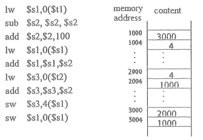
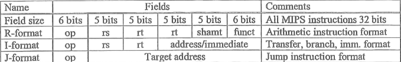
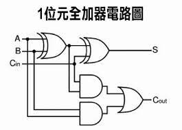

# 109 甲組

1.Memory addressing
Consider the following MIPS code segment. Initially, the memory contents are given as follows.Assume that the content of \$t1 and \$t2 are 3000 and 3004, respectively. Show the step-by-step operation taken by each instruction in the following code segment.

- lw $s1,0($t1)
- sub $s2, $s2, $s2
- add $s2,$2,100
- lw $s1,0($s1)
- add Ss1.$sl,$s2
- lw $s3,0($t2)
- add $s3 $s3,$s2
- SW $s3,4($s1)
- SW $s1,0($sl)

詳解:

    lw $s1,0($t1)
    - Load the value from memory address 3000 (the value of register $t1) into register $s1.

    sub $s2, $s2, $s2 (s2 = 0)
    - Subtract register $s2 from itself and store the result in register $s2. This effectively clears register $s2 to zero.
    
    add $s2,$2,100
    - Add 100 to register $s2.
    
    lw $s1,0($s1)
    - Load the value from memory address stored in register $s1 into register $s1.
    
    add $s1,$sl,$s2
    - Add register $s2 to the value stored in register $s1 and store the result in register $s1.
    
    lw $s3,0($t2)
    - Load the value from memory address 3004 (the value of register $t2) into register $s3.
    
    add $s3 $s3,$s2
    - Add register $s2 to the value stored in register $s3 and store the result in register $s3.
    
    SW $s3,4($s1)
    - Store the value stored in register $s3 to memory address 4 bytes offset from the value stored in register $s1.
    
    SW $s1,0($sl)
    - Store the value stored in register $s1 to memory address 0 (the value of register $sl).

    $s1: 3100

    $s2: 100

    $s3: 3104

    $t1: 3000

    $t2: 3004

2.There are three types of MIPS instructions: R-type, I-type, and J-type. The instruction formats are given below.

- (a) Decide what is the maximum ranges of (i) immediate, (ii) displacement, and (iii) PC-relative branch.

    詳解:

      Immediate: $2^15 - 1$

      Displacement: $2^15-1$

      PC-relative branch: $2^15$

- (b) Consider the following three instructions. What are the types of them?
  - (i) sub \$s2, \$s2,$s2 #subtraction

        R-type
  - (ii) $s1,100($s1) #load word

        I-type
  - (iii) beq \$s0,$1,Exit #branch to Exit if \$s0 = $1

        I-type

3.Memory system
In a virtual memory system, it takes 10 ns to access a word in the cache. If a word is in main memory
but not in the cache, 30 ns are needed to load it into the cache, and then the reference to it is started
again. If the word is not in main memory, 12 ms are required to fetch the word from disc, followed by
30ns to copy it to the cache, and then the reference is started again.

- (a) Let the cache hit ratio be 0.9 and the main-memory hit ratio be 0.6. What is the average time
(in ns) to access a referenced word in the system?

詳解:

  Location | Hit Ratio | Access Time | Average Time |
  :-:|:-:|:-:|:-:|
  Cache | 0.9 | 10 ns | 9 ns |
  Main Memory | 0.6 | 30 ns + 10 ns = 40 ns | 24 ns |
  Disc | 0.4 | 12 ms + 30 ns + 10 ns = 12000040 ns | 4800016 ms |

    Average Access Time

    = (0.9 \* 10 ns) + (0.6 \* 40 ns) + (0.4 \* 12000040 ns)

    = 9 ns + 24 ns + 4800016 ns

    = 4800049

- (b) The operating system can improve the CPU utilization by trying to do something else other than
idle for 12 ms to wait for the required data to be load from disc to the main memory. Explain how this
process works.

詳解:

    當CPU需要存取一格不在記憶體的字時。他需要等作業系統去拿資料，那這樣就會因為硬碟不斷存取而變得很慢。
    
    所以我們可以用context switch，並將該工作的階段凍結，並執行其他工作，當硬碟存到資料時，再將工作切換回來繼續執行。

4.Arithmetic
(a)  The 32-bit words in registers $s1 and $s2 are given below:

\$s1: 0100 0000 0000 0000 0000 0000 0000 0000

\$s2: 0111 1111 1111 1111 1111 1111 1111 1111

What are the results of executing the following instructions? Explain your answer.

addu \$s3, \$s1, \$s2

add \$s4, \$s1, \$s2

詳解:

because

addu: unsigned addition

add: addition

so

addu $s3, $s1, $s2: $s3 = 0xbfffffff

add $s4, $s1, $s2: $s4 = 0x40000001

(b)  The addition operation is execued by an adder. A. 1-bit full adder takes three i-bit inputs (a, b, CarryIn) and produces a 2-bit outputs (CarryOut, Sum) representing sum of the input bits. A 32-bit adder can
be constructed by cascating 32 1-bit full adders. Write down the logic function of CarryOut and Sum.

一顆 1 位元全加器有三個輸入：加數 A、加數 B 和進位輸入 Cin，以及兩個輸出：進位輸出 Cout 和和輸出 Sum。

Cout 的邏輯函數如下： Cout = AB + AB * Cin
Sum  的邏輯函數如下： Sum = A + B + Cin

4個1-bit的加法器組成4-bit的加法器，再將8個4-it的加法器組成32-bit的加法器

5.Given the value printed by the following code fragments:

- int resultA = (0 + 15) / 2;
- double resultB = 2.0e-6 * 100000000.1;
- boolean resultC = true && false || true && true;
- System.out.println("(a)" + resultA);
- System.out.prilnth("(b) " + resultB);
- System.out.println("(c) " + resultC);

(a)7
(b)200.0000002
(c)true

6.What is the outcome for the following recursive function when Test(3):

- Test (int n) {
  - String s = Test(n-3) + n + Test(n-2) + n;
  - If (n<=0) return "";
  - Return S;
- }
Test(3)
= Test(0)3Test(1)3
= 3Test(-2)1Test(-1)13
= 3113

7.Please show that the sink-based Heap construction uses  <=2N compares and <=N exchanges

詳解【bard】:

堆排序是一種非常高效的排序算法，它利用堆的性質來將數據排序。堆排序的核心是堆的構造，而堆的構造通常採用「下沉」的方法。

下沉的過程是將堆的最後一個元素（也就是根元素）與其子節點進行比較，如果子節點的值比根元素大，則將子節點與根元素進行交換。然後，將根元素的值更新為子節點的值，並將子節點作為新的根元素繼續進行下沉。

下沉的過程需要進行比較和交換兩種操作。比較操作是用來確定子節點是否比根元素大。交換操作是用來將子節點與根元素進行交換。

要證明下沉-基於的堆構造使用 <=2N 次比較和 <=N 次交換，我們可以進行如下分析：

對於一個大小為 N 的堆，下沉過程需要進行 N 次下沉操作。
每一次下沉操作最多需要進行一次比較和一次交換。
因此，下沉過程最多需要進行 N 次比較和 N 次交換。
但是，在實際情況中，下沉過程的比較次數可能會小於 N。這是因為，如果子節點的值不比根元素大，則不需要進行交換。因此，下沉過程的比較次數最多為 N。

同理，下沉過程的交換次數最多為 N。

因此，下沉-基於的堆構造使用 <=2N 次比較和 <=N 次交換。

具體的證明如下：

假設堆的大小為 N，則下沉過程需要進行 N 次下沉操作。

每一次下沉操作，如果子節點的值比根元素小或等於，則不需要進行交換。因此，每一次下沉操作最多需要進行一次比較和一次交換。

因此，下沉過程最多需要進行 N 次比較和 N 次交換。

但是，在實際情況中，下沉過程的比較次數可能會小於 N。這是因為，如果子節點的值不比根元素大，則不需要進行交換。因此，下沉過程的比較次數最多為 N。

同理，下沉過程的交換次數最多為 N。

因此，下沉-基於的堆構造使用 <=2N 次比較和 <=N 次交換。

8.The table below, from an old published road map, purports to give the length of the shortest pathes
connecting the cities. It contains an eror. Correct the table. Also, add a table that that sbow how to achieve
the shortest routes.
$\begin{array}{cc}
~&Providence&Westerly&New London&Norwich\\
Providence&-&53&54&48\\
Westerly&53&-&18&101\\
New London&54&18&-&12\\
Norwich&48&101&12&-
\end{array}$

to

$\begin{array}{cc}
~&Providence&Westerly&New London&Norwich\\
Providence&-&53&54&48\\
Westerly&53&-&18&68\\
New London&54&18&-&12\\
Norwich&48&68&12&-
\end{array}$

Ans : 54 + 12 = 66

9.Please indicate which of the following sort algorithms is/are stable? (Multiple Choice)

      stable algorithm: A sorting algorithm is said to be stable if two objects with equal keys appear in the same order in sorted output as they appear in the input data set

- (a) Quick Sort x
- (b) Selection Sort x
- (c) Shell Sort x
- (d) Merge Sort
- (e) Heap Sort x

Answer: d

10.Suppose that the following processes arrive for execution at the times indicated. Each process will run
for the amount of time listed. In answering the questions, use nonpreemptive scheduling, and base all
decisions on the information you have at the time the decision must be made.

$\begin{array}{cc}
Process&Arrival Time&Burst Time\\
\hline
P_1&0.0&8\\
P_2&0.4&4\\
P_3&1.0&1\\
\end{array}$

- (a) What is the average turnaround time for these processes with the FCFS scheduling algorithm ? (3%)

      (8.0 + 12.0-0.4 + 13.0-1) / 3 = 10.53
- (b) What is the average turnaround time for these processes with the SJF scheduling algorithm? (3%)

      (9 + 13 + 13.4) / 3 = 11.8
- (c) The SJF algorithm is supposed to improve performance, but notice that we chose to run process P1 at
time O because we did not know that two shorter processes would arrive soon. Compute what the
average turnaround time will be if the CPU is left idle for the first 1 unit and then SJF scheduling is
used. Remember that processes P1 and P2 are waiting during this idle time, so their waiting time may
increase. This algorithm could be known as future-knowledge scheduling. (4%)

      (9 + 13 + 13.4) / 3 = 11.8

11.Please explain the following terms

- (a) Semaphore (2%)

      在系統中，給予每一個行程一個號誌，代表每個行程目前的狀態，未得到控制權的行程會在特定地方被強迫停下來，等待可以繼續進行的訊號到來。如果號誌是一個任意的整數，通常被稱為計數號誌（Counting semaphore），或一般號誌（general semaphore）；如果號誌只有二進位的0或1，稱為二進位號誌（binary semaphore）。
- (b) Race Condition (2%)

      描述一個系統或者 Process 的輸出依賴於不受控制的事件出現順序或者出現時機。比如有多個 Process 嘗試存取同一個記憶體位置，如果沒有處理好，就有可能發生無法預期的執行結果，這種情況容易發生在錯誤的後端程式、資料庫、檔案系統設計或是其他採用多執行緒設計的程式。
- (c) Thrashing (2%)

      當一個 process 花在 paging 的時間比執行時間更高時，稱為 thrashing。

- (d) Demand Paging (2%)

      指只將程式的一部分載入到記憶體中,原本在job開始執行一直到結束,整個job都要放在記憶體中,假如程式引用到沒有載入的分頁,再將分頁載入到page frame
- (e) Fragmentation (2%)

      指儲存空間使用效率低下，結果導致功能、執行效率變低或二者兼而有之的現象。

12.Given the following array A = [19, 3, 5, 1, 2, 4, 6, 7, 11, 10, 8, 0]. Please use 3-way quick sort
algorithm to sort the elements in A. (10%)

      用這個:
      =============================================================
      i = 1
      j = 1
      m1 = 0
      m2 = 0

      while i < len(A):
            if A[i] < pivot:
                  A[i], A[j] = A[j], A[i]
                  j += 1
            elif A[i] == pivot:
                  m2 += 1
                  m1 += 1
            else:
                  m2 += 1
            i += 1
      =============================================================
      Step 1：選擇一個 pivot 作為分割點。

      在 3-way quick sort 中，選擇陣列中的第一個元素作為 pivot (19)

      Step 2：把陣列分成三部分：小於、等於、大於 pivot。

      然後從陣列的第二個元素開始找。如果找到的元素小於 pivot，就把它跟下一個交換，然後把下一個元素的index加 1。
      如果找到的=pivot: m1+1,m2+1。找到的>pivot，m2+1。

      Step 3：把pivot放到中間

      把 pivot 跟 m1 位置的元素交換

      因為 m1 等於 0。因此，19><0。

      Step 4：再把大於跟小於的跑一遍3-way

      我們分別對陣列中小於 pivot 和大於 pivot 的子陣列進行排序。

      [0, 1, 2, 3, 4, 5, 6, 7, 8] [10, 11] 19

      Step 5：結果

      [0, 1, 2, 3, 4, 5, 6, 7, 8, 10, 11, 19]

13.What are necessary conditions which can lead to a deadlock situation in a system? (5%)

    如果同時(simultaneously)存在四個條件，就會發生 deadlock

      mutual exclusion 互斥 (一次只有一個 process 使用資源)
      
      hold and wait 持有並等待 (process 持有部分資源又在等待其他 processes 所持有的資源)
      
      no preemption 不可強奪 (process 不可以搶奪其他 waiting process 所持有的資源，除非他自願釋放)

      circular waiting 循環等待 (存在一組 process 等待另一個 process 的資源形成循環: P0 -> P1 -> P2 …-> Pn -> P0)

14.Given an array of distinct integers. The task is to count all the triplets such that sum of two elements
equals the third element. Please write a problem to solve this task with a time complexity O($n^2$) (5%)

    def count_triplets(arr):
      freq = {}
      for element in arr:
        if element not in freq:
          freq[element] = 0
        freq[element] += 1

      count = 0
      for i in range(len(arr)):
        for j in range(i + 1, len(arr)):
          sum = arr[i] + arr[j]

          # Check if the sum is present in the hash table.
          if sum in freq and freq[sum] > 0:
            count += 1
            freq[sum] -= 1

      return count
